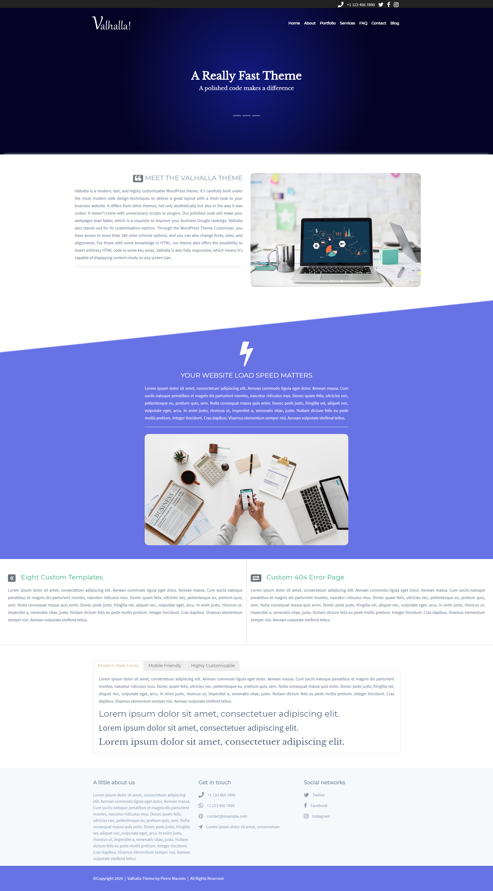

# Valhalla WP Theme

Valhalla is a modern, fast, and highly customizable WordPress theme. It's carefully built under the most modern web design techniques to deliver a great layout with a fresh look to your business website. It differs from other themes, not only aesthetically but also in the way it was coded. It doesn't come with unnecessary scripts or plugins. Our polished code will make your webpages load faster, which is a requisite to improve your business Google rankings. Valhalla also stands out for its customization options. Through the WordPress Theme Customizer, you have access to more than 180 color scheme options, and you can also change fonts, sizes, and alignments. For those with some knowledge in HTML, our theme also offers the possibility to insert arbitrary HTML code in some key areas. Valhalla is also fully responsive, which means it's capable of displaying content nicely on any screen size.

# Screenshots

  
  

